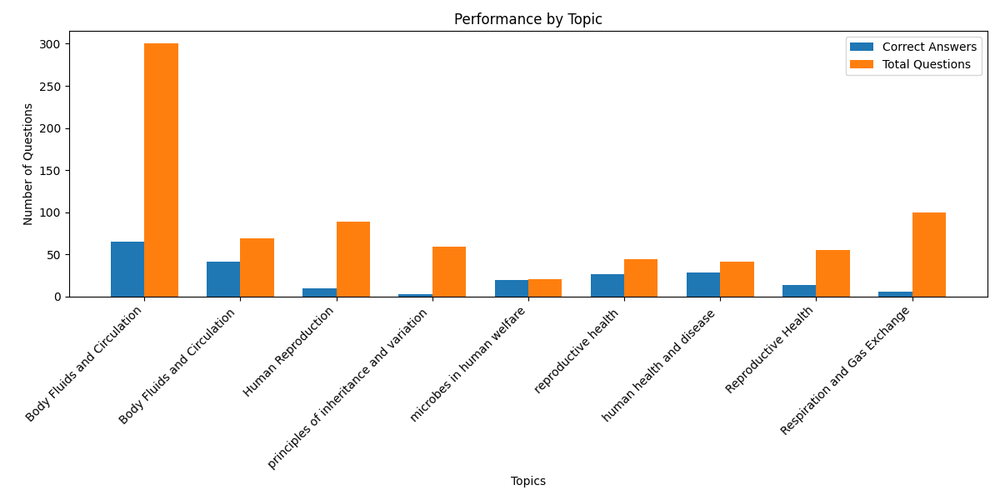
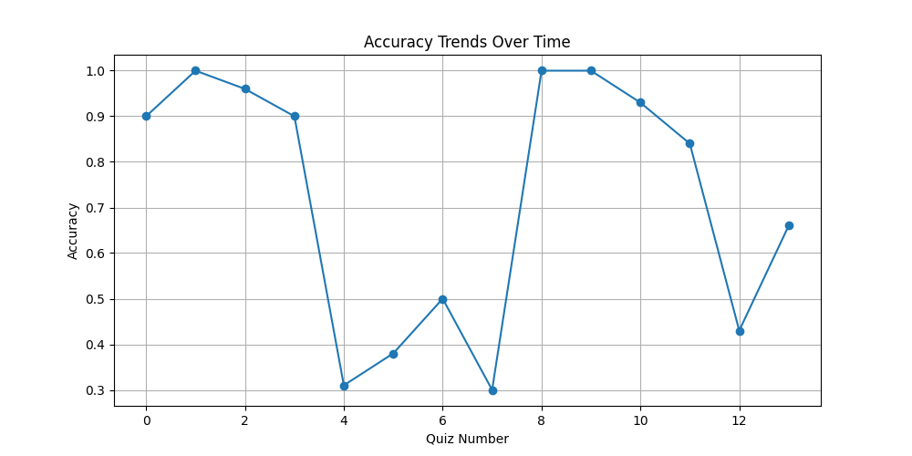

# Interview Round 1: Student Rank Predictor

Develop a solution to analyze testline quiz performance and predict student rank based on past year NEET exam results. (You can use any tech-stack of your choice)

**App Link:** NEET Testline - on Google Play

## Data Overview
You will work with two datasets:
- **Current Quiz Data:** Details of a user’s latest quiz submission, including questions, topics, and responses, etc.
- **Historical Quiz Data:** Performance data from the last 5 quizzes for each user, including scores and response map (Key: Question Id, Value: Selected option id).

## Task
1. **Analyze the Data:**
   - Explore the schema and identify patterns in student performance by topics, difficulty levels, and response accuracy.
2. **Generate Insights:**
   - Highlight weak areas, improvement trends, and performance gaps for a given user.
3. **Rank Prediction:**
   - Develop an algorithm/probabilistic model that predicts the student's NEET rank based on their quiz performance and previous year NEET exam results.
4. **Bonus Points:**
   - Extend your solution to predict the most likely college a student could be admitted to, based on their predicted NEET rank.

## Submission Guidelines
Submit the source code via a GitHub link, including:
- A README with setup instructions, project overview, and approach description.
- Screenshots of key visualizations and insights summary.
- A 2-5 minute video demonstrating the script/API with sample inputs, output, and a brief explanation of the logic and recommendations.

To follow the submission guidelines, here's a detailed breakdown of what you need to include in your GitHub repository:

### 1. **GitHub Repository Structure:**

```
/project-root
    ├── /app
    │   ├── /models
    │   ├── /utils
    │   └── controller.py
    ├── /tests
    │   └── test_controller.py
    ├── README.md
    ├── requirements.txt
    ├── /assets
    │   ├── screenshots
    │   └── video_demo.mp4
    └── index.html
```

### 2. **README.md**: (Example Content)

# Quiz Performance Analysis & Rank Prediction

## Project Overview
This project provides a comprehensive analysis of student performance in quizzes, generates insights, and predicts ranks based on quiz performance. The key features of this project include:
- **Performance Analysis:** Tracks accuracy, score, mistakes, and overall performance.
- **Insights Generation:** Provides insights like weak areas, trends in performance, and recommendations for improvement.
- **Rank Prediction:** Predicts the rank of a student based on their quiz performance.
- **College Prediction:** Suggests a college based on predicted rank.

The backend is implemented using FastAPI, with endpoints that allow users to:
- Analyze performance.
- Generate insights.
- Predict rank and college based on the rank.

## Setup Instructions

### Prerequisites:
- Python 3.x
- FastAPI
- Uvicorn (for running the FastAPI app)
- NumPy (for data processing)

### Running Tests:
To run the tests, use the following command:
```bash
pytest tests/test_controller.py
```

## Project Approach

1. **Performance Analysis**: 
   - Analyzes historical quiz data by tracking student performance metrics such as accuracy, total score, mistakes corrected, and rank.
   
2. **Insight Generation**: 
   - Based on performance analysis, generates insights such as overall performance, weak areas (topics with accuracy below 50%), and performance improvement trends.
   
3. **Rank Prediction**: 
   - Predicts the rank of a student based on a set of features (score, accuracy, mistakes corrected, etc.) using a trained model.

4. **College Prediction**:
   - Based on the predicted rank, suggests a college from a predefined set of colleges and their rank ranges.

## Key Visualizations and Insights

- **Visualizations**:
  Screenshots of the analysis, insights, and trends can be found in the `assets/screenshots` folder.

- **Insights Summary**:
  - **Overall Performance**: The average accuracy and scores across all quizzes.
  - **Weak Areas**: Topics with accuracy below 50%.
  - **Improvement Trends**: Comparison of performance over time (improvement or no change).

## Video Demonstration

- A 2-5 minute video explaining the logic and recommendations of the system, including a demo of the API in action with sample inputs and outputs, can be found in the `assets/video_demo.mp4` file.

## License
This project is licensed under the MIT License - see the [LICENSE](LICENSE) file for details.

---

### 3. **Key Visualizations and Insights (Screenshots)**

Include screenshots in the `assets/screenshots` folder to show key visualizations of the results. For example:

- **Performance Analysis**: A table or graph showing a student's overall performance.
- **Weak Areas**: A bar chart showing topics with the lowest accuracy.
- **Improvement Trend**: A line graph showing the accuracy improvement over time.

You can generate these visualizations using libraries like **Matplotlib**, **Seaborn**, or **Plotly**, and save them as PNG or JPG images.

### 4. **Video Demonstration**

Record a 2-5 minute video explaining the functionality of the project. The video should cover:

- **Overview of the Project**: Briefly explain what the project does and its key features.
- **API Walkthrough**: Demonstrate the functionality of the API by making requests to it (using Postman or a similar tool) and show the sample inputs and outputs.
- **Logic and Recommendations**: Briefly explain how the logic works, what data is used for analysis, and how the predictions and insights are generated.
- **Where to Find the Files**: Point to the screenshots and video files in the repository.

Save the video as `video_demo.mp4` and place it in the `assets` folder.

### 5. **Test Files**

Ensure that your test files are located in the `tests` folder, and that they properly test the functionality of your API. This should include unit tests for all key functionality in your controller.

### 6. **Requirements File (`requirements.txt`)**

Generate a `requirements.txt` file that lists all the Python dependencies needed for the project:

```bash
fastapi
uvicorn
numpy
pytest
```

You can generate this file automatically by running:

```bash
pip freeze > requirements.txt
```

### 7. **HTML File (`index.html`)**

Include an `index.html` file in the project root to provide a simple web interface for interacting with the API. This file can be used to test the API endpoints and visualize the results.

```html
<!DOCTYPE html>
<html lang="en">
<head>
    <meta charset="UTF-8">
    <meta name="viewport" content="width=device-width, initial-scale=1.0">
    <title>Rank Predictor</title>
</head>
<body>
    <h1>Student Rank Predictor</h1>
    <form id="rankForm">
        <label for="quizData">Enter Quiz Data:</label>
        <textarea id="quizData" name="quizData" rows="10" cols="50"></textarea>
        <br>
        <button type="button" onclick="predictRank()">Predict Rank</button>
    </form>
    <div id="result"></div>

    <script>
        async function predictRank() {
            const quizData = document.getElementById('quizData').value;
            const response = await fetch('/predict-rank', {
                method: 'POST',
                headers: {
                    'Content-Type': 'application/json'
                },
                body: JSON.stringify({ quizData })
            });
            const result = await response.json();
            document.getElementById('result').innerText = `Predicted Rank: ${result.rank}`;
        }
    </script>
</body>
</html>
```

---

### Summary

1. **GitHub Link**: Include your project source code along with the README, screenshots, and video demonstration.
2. **Structure**: Organize the project as described above.
3. **Tests**: Ensure that the FastAPI endpoints are properly tested.
4. **Explanation**: Provide a video demo, screenshots, and an explanation in the README file.

## Setup Instructions
1. **Clone the repository:**
   ```bash
   git clone <repository-url>
   cd RankPredictor
   ```

2. **Create a virtual environment and activate it:**
   ```bash
   python -m venv venv
   source venv/bin/activate  # On Windows, use `venv\Scripts\activate`
   ```

3. **Install the required dependencies:**
   ```bash
   pip install -r requirements.txt
   ```

4. **Run the FastAPI server:**
   ```bash
   uvicorn app.main:app --reload
   ```

5. **Access the API documentation:**
   Open your browser and navigate to `http://127.0.0.1:8000/docs` to view the interactive API documentation.

## Approach Description
### Data Analysis Functions
- **analyze_performance:** Analyzes student performance by topics, difficulty levels, and response accuracy.
- **generate_insights:** Highlights weak areas, improvement trends, and performance gaps for a given user.
- **predict_rank:** Predicts the student's NEET rank based on their quiz performance and previous year NEET exam results.
- **predict_college:** Predicts the most likely college a student could be admitted to based on their predicted NEET rank.

### API Endpoints
- **GET /analyze-performance**: Analyzes the performance of a student based on historical quiz data.
- **GET /generate-insights**: Generates insights from the analyzed performance data.
- **POST /predict-rank**: Predicts the NEET rank for a student based on their performance data.
- **POST /predict-college**: Predicts the most likely college for a student based on their predicted rank.

## Screenshots
### Key Visualizations and Insights Summary



## Video Demonstration
[Watch the video demonstration](https://example.com/video-demo)

In the video, we demonstrate the script/API with sample inputs, output, and provide a brief explanation of the logic and recommendations.